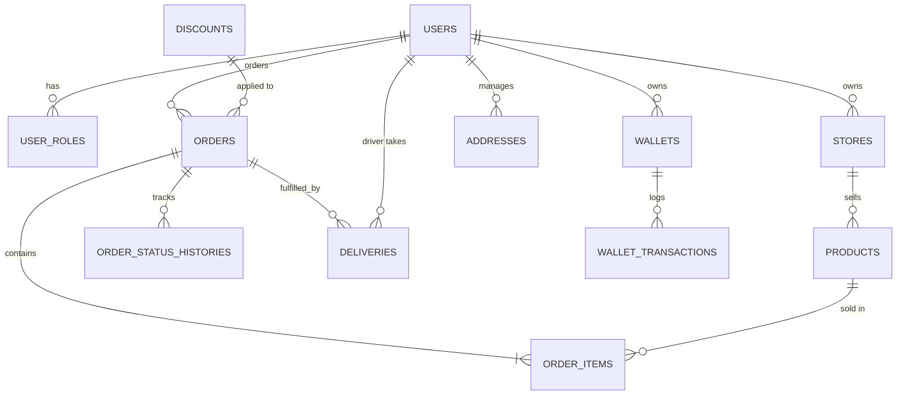

# SEAPEDIA: Architecture & Project Plan (Levels 1 - 7)

This document provides the complete technical design, Physical Data Model (PDM), directory structures, and API specifications for **SEAPEDIA**. Use this as your step-by-step master plan to build the project from Level 1 to Level 7.

---

## Technology Stack

*   **Backend**: Go (Golang)
    *   **Framework**: [Gin Gonic](https://github.com/gin-gonic/gin) (HTTP Router & Middleware)
    *   **ORM**: [GORM](https://gorm.io/) (Object-Relational Mapping for PostgreSQL)
    *   **Database**: **PostgreSQL**
    *   **Auth**: JSON Web Tokens (`golang-jwt/jwt`) & Hashing (`golang.org/x/crypto/bcrypt`)
*   **Frontend**: Next.js (App Router)
    *   **Styling**: Tailwind CSS v4 (configured via `@tailwindcss/postcss`)
    *   **Icons**: Lucide React (recommended for dashboard iconography)

---

## Project Directory Structure

```text
seapedia/
├── backend/
│   ├── cmd/
│   │   └── server/
│   │       └── main.go             # Application entry point
│   ├── internal/

│   │   ├── config/
│   │   │   └── db.go               # GORM DB connection & configuration
│   │   ├── handlers/
│   │   │   ├── auth.go             # Registration, Login, active role choice
│   │   │   ├── store.go            # Store profile and product CRUD (L2)
│   │   │   ├── buyer.go            # Wallet, cart, address, and checkout (L3)
│   │   │   ├── discount.go         # Voucher & Promo management (L4 & L6)
│   │   │   ├── driver.go           # Driver jobs workflow (L5)
│   │   │   ├── admin.go            # Dashboard analytics, simulation endpoints (L6)
│   │   │   └── review.go           # Application reviews handler (L1)
│   │   ├── middleware/
│   │   │   ├── auth.go             # JWT validation and extract claims
│   │   │   └── rbac.go             # Role-Based Access Control handler
│   │   └── models/
│   │       └── models.go           # Unified physical data structures (GORM models)
│   ├── go.mod
│   └── go.sum
├── frontend/
│   ├── app/
│   │   ├── (public)/               # Guest-accessible pages
│   │   │   ├── page.tsx            # Landing & testimonials list
│   │   │   ├── catalog/            # Public product list
│   │   │   │   └── [id]/page.tsx   # Read-only product details
│   │   │   └── reviews/page.tsx    # Write app review page
│   │   ├── (auth)/
│   │   │   ├── register/page.tsx   # Registration form
│   │   │   ├── login/page.tsx      # Login form
│   │   │   └── select-role/page.tsx# Active role selection page
│   │   ├── dashboard/              # Protected dashboards (by active role)
│   │   │   ├── admin/
│   │   │   ├── buyer/
│   │   │   ├── seller/
│   │   │   └── driver/
│   │   ├── layout.tsx
│   │   └── globals.css
│   ├── components/
│   │   └── ui/                     # Reusable design assets (Button, Card, Input)
│   └── package.json
└── plan/
    ├── soal.md                     # original task requirements
    └── architecture_plan.md        # This planning file
```

---

## Physical Data Model (PDM)

All database entities, constraints, and relationships are designed below for PostgreSQL using GORM structures.



### **Entity Definitions**

#### **1. Authentication & Roles**
```go
// User maps to "users" table
type User struct {
	ID           uint       `gorm:"primaryKey" json:"id"`
	Username     string     `gorm:"uniqueIndex;not null;size:50" json:"username"`
	PasswordHash string     `gorm:"not null" json:"-"`
	Roles        []UserRole `gorm:"foreignKey:UserID;constraint:OnDelete:CASCADE" json:"roles"`
	Wallet       *Wallet    `gorm:"foreignKey:UserID" json:"wallet,omitempty"`
	CreatedAt    time.Time  `json:"created_at"`
}

// UserRole maps to "user_roles" table (Supports multi-role association)
type UserRole struct {
	ID        uint      `gorm:"primaryKey" json:"id"`
	UserID    uint      `gorm:"not null;uniqueIndex:idx_user_role" json:"user_id"`
	Role      string    `gorm:"not null;size:20;uniqueIndex:idx_user_role" json:"role"` // 'Admin', 'Seller', 'Buyer', 'Driver'
	CreatedAt time.Time `json:"created_at"`
}
```

#### **2. Application Feedback**
```go
// AppReview maps to "app_reviews" table (L1 Feature)
type AppReview struct {
	ID           uint      `gorm:"primaryKey" json:"id"`
	ReviewerName string    `gorm:"not null;size:100" json:"reviewer_name"`
	Rating       int       `gorm:"not null;check:rating >= 1 AND rating <= 5" json:"rating"`
	Comment      string    `gorm:"type:text;not null" json:"comment"`
	CreatedAt    time.Time `json:"created_at"`
}
```

#### **3. Seller Store & Catalog**
```go
// Store maps to "stores" table (L2 Feature)
type Store struct {
	ID          uint      `gorm:"primaryKey" json:"id"`
	UserID      uint      `gorm:"uniqueIndex;not null" json:"user_id"` // User who owns this store
	Name        string    `gorm:"uniqueIndex;not null;size:100" json:"name"`
	Description string    `gorm:"type:text" json:"description"`
	Products    []Product `gorm:"foreignKey:StoreID;constraint:OnDelete:CASCADE" json:"products"`
	CreatedAt   time.Time `json:"created_at"`
}

// Product maps to "products" table (L2 Feature)
type Product struct {
	ID          uint      `gorm:"primaryKey" json:"id"`
	StoreID     uint      `gorm:"not null" json:"store_id"`
	StoreName   string    `gorm:"-" json:"store_name"` // Virtual display helper
	Name        string    `gorm:"not null;size:150" json:"name"`
	Description string    `gorm:"type:text" json:"description"`
	Price       float64   `gorm:"not null" json:"price"`
	Stock       int       `gorm:"not null;default:0" json:"stock"`
	CreatedAt   time.Time `json:"created_at"`
}
```

#### **4. Buyer Profile & Cart**
```go
// Wallet maps to "wallets" table (L3 Feature)
type Wallet struct {
	ID           uint                `gorm:"primaryKey" json:"id"`
	UserID       uint                `gorm:"uniqueIndex;not null" json:"user_id"`
	Balance      float64             `gorm:"not null;default:0" json:"balance"`
	Transactions []WalletTransaction `gorm:"foreignKey:WalletID" json:"transactions,omitempty"`
	UpdatedAt    time.Time           `json:"updated_at"`
}

// WalletTransaction maps to "wallet_transactions" (L3 Feature)
type WalletTransaction struct {
	ID        uint      `gorm:"primaryKey" json:"id"`
	WalletID  uint      `gorm:"not null" json:"wallet_id"`
	Amount    float64   `gorm:"not null" json:"amount"` // Positive for Top-Up/Refund, Negative for payments
	Type      string    `gorm:"not null;size:20" json:"type"` // 'TOPUP', 'PAYMENT', 'REFUND'
	CreatedAt time.Time `json:"created_at"`
}

// Address maps to "addresses" table (L3 Feature)
type Address struct {
	ID          uint      `gorm:"primaryKey" json:"id"`
	UserID      uint      `gorm:"not null" json:"user_id"`
	AddressLine string    `gorm:"type:text;not null" json:"address_line"`
	IsDefault   bool      `gorm:"not null;default:false" json:"is_default"`
	CreatedAt   time.Time `json:"created_at"`
}
```

#### **5. Discount Logic**
```go
// Discount maps to "discounts" table (L4 Feature)
type Discount struct {
	ID           uint      `gorm:"primaryKey" json:"id"`
	Code         string    `gorm:"uniqueIndex;not null;size:50" json:"code"`
	Type         string    `gorm:"not null;size:20" json:"type"` // 'Voucher' or 'Promo'
	ValueType    string    `gorm:"not null;size:20" json:"value_type"` // 'Fixed' or 'Percentage'
	Value        float64   `gorm:"not null" json:"value"`
	MinPurchase  float64   `gorm:"not null;default:0" json:"min_purchase"`
	MaxDiscount  float64   `gorm:"not null;default:0" json:"max_discount"` // Max discount cap for percentage types
	MaxUsage     int       `gorm:"not null;default:0" json:"max_usage"` // For Vouchers (0 = unlimited)
	UsageCount   int       `gorm:"not null;default:0" json:"usage_count"`
	ExpiryDate   time.Time `gorm:"not null" json:"expiry_date"`
	CreatedAt    time.Time `json:"created_at"`
}
```

#### **6. Orders & Fullfilment Lifecycle**
```go
// Order maps to "orders" table (L3 Feature)
type Order struct {
	ID             uint                 `gorm:"primaryKey" json:"id"`
	BuyerID        uint                 `gorm:"not null" json:"buyer_id"`
	StoreID        uint                 `gorm:"not null" json:"store_id"`
	DiscountID     *uint                `json:"discount_id,omitempty"`
	DeliveryMethod string               `gorm:"not null;size:20" json:"delivery_method"` // 'Instant', 'Next Day', 'Regular'
	DeliveryFee    float64              `gorm:"not null" json:"delivery_fee"`
	Subtotal       float64              `gorm:"not null" json:"subtotal"`
	DiscountAmount float64              `gorm:"not null;default:0" json:"discount_amount"`
	TaxAmount      float64              `gorm:"not null" json:"tax_amount"` // 12% PPN
	Total          float64              `gorm:"not null" json:"total"`
	Status         string               `gorm:"not null;size:30" json:"status"` // 'Sedang Dikemas', 'Menunggu Pengirim', 'Sedang Dikirim', 'Pesanan Selesai', 'Dikembalikan'
	CreatedAt      time.Time            `json:"created_at"`
	UpdatedAt      time.Time            `json:"updated_at"`
	Items          []OrderItem          `gorm:"foreignKey:OrderID;constraint:OnDelete:CASCADE" json:"items"`
	StatusHistory  []OrderStatusHistory `gorm:"foreignKey:OrderID" json:"status_history"`
	Delivery       *Delivery            `gorm:"foreignKey:OrderID" json:"delivery,omitempty"`
}

// OrderItem maps to "order_items"
type OrderItem struct {
	ID        uint    `gorm:"primaryKey" json:"id"`
	OrderID   uint    `gorm:"not null" json:"order_id"`
	ProductID uint    `gorm:"not null" json:"product_id"`
	Quantity  int     `gorm:"not null" json:"quantity"`
	Price     float64 `gorm:"not null" json:"price"` // Captured price at checkout
}

// OrderStatusHistory maps to "order_status_histories"
type OrderStatusHistory struct {
	ID        uint      `gorm:"primaryKey" json:"id"`
	OrderID   uint      `gorm:"not null" json:"order_id"`
	Status    string    `gorm:"not null;size:30" json:"status"`
	CreatedAt time.Time `json:"created_at"`
}

// Delivery maps to "deliveries" table (L5 Feature)
type Delivery struct {
	ID          uint       `gorm:"primaryKey" json:"id"`
	OrderID     uint       `gorm:"uniqueIndex;not null" json:"order_id"`
	DriverID    *uint      `json:"driver_id,omitempty"` // Nullable until a Driver claims it
	Status      string     `gorm:"not null;size:20" json:"status"` // 'Pending', 'Assigned', 'Completed'
	AcceptedAt  *time.Time `json:"accepted_at,omitempty"`
	CompletedAt *time.Time `json:"completed_at,omitempty"`
}
```

---

## 📡 API Endpoints Specifications

All API responses containing errors must return standard formats:
`{"error": "error message details"}`

### **1. Level 1: Auth & Public Reviews**
*   `POST /api/auth/register` (Public)
    *   Req: `{"username": "johndoe", "password": "securepassword", "roles": ["Buyer", "Seller"]}`
    *   Resp: `{"message": "User registered successfully"}`
*   `POST /api/auth/login` (Public)
    *   Req: `{"username": "johndoe", "password": "securepassword"}`
    *   Resp: `{"token": "JWT_TOKEN_STRING", "roles": ["Buyer", "Seller"]}`
*   `POST /api/auth/role` (Protected - JWT Required)
    *   Req: `{"active_role": "Buyer"}` (Must check if the user actually owns the role)
    *   Resp: `{"message": "Active role set to Buyer", "active_role": "Buyer"}`
*   `GET /api/auth/profile` (Protected - JWT Required)
    *   Resp: `{"id": 1, "username": "johndoe", "roles": ["Buyer", "Seller"], "active_role": "Buyer"}`
*   `GET /api/reviews` (Public)
    *   Resp: `[{"reviewer_name": "Alice", "rating": 5, "comment": "Great App!"}]`
*   `POST /api/reviews` (Public/Optional Login)
    *   Req: `{"reviewer_name": "GuestUser", "rating": 4, "comment": "Nice UI"}`
    *   Resp: `{"message": "Review submitted successfully"}`

### **2. Level 2: Seller Catalog**
*   `POST /api/seller/store` (Protected - Role: Seller)
    *   Req: `{"name": "Epic Store", "description": "High quality goods"}`
    *   Resp: `{"id": 1, "name": "Epic Store", "description": "High quality goods"}`
*   `GET /api/seller/products` (Protected - Role: Seller)
    *   Resp: `[{"id": 1, "name": "Item A", "price": 100, "stock": 10}]`
*   `POST /api/seller/products` (Protected - Role: Seller)
    *   Req: `{"name": "New Item", "description": "Good item", "price": 50000, "stock": 20}`
*   `PUT /api/seller/products/:id` (Protected - Role: Seller - must verify product ownership)
    *   Req: `{"name": "Updated Name", "price": 55000, "stock": 15}`
*   `DELETE /api/seller/products/:id` (Protected - Role: Seller)
*   `GET /api/catalog` (Public)
    *   Resp: Product array matching current DB state.
*   `GET /api/catalog/:id` (Public)
    *   Resp: Product detail + store owner details.

### **3. Level 3: Buyer Wallet, Cart, and Checkout**
*   `POST /api/buyer/topup` (Protected - Role: Buyer)
    *   Req: `{"amount": 500000}`
    *   Resp: `{"new_balance": 500000}`
*   `GET /api/buyer/wallet` (Protected - Role: Buyer)
    *   Resp: Balance + transaction log details.
*   `POST /api/buyer/address` (Protected - Role: Buyer)
    *   Req: `{"address_line": "123 Ocean Street"}`
*   `GET /api/buyer/address` (Protected - Role: Buyer)
*   `POST /api/buyer/checkout` (Protected - Role: Buyer)
    *   Req: `{"items": [{"product_id": 1, "quantity": 2}], "delivery_method": "Instant", "discount_code": "VOUCH10"}`
    *   Resp: Full calculated order breakdown (Subtotal, Discount, Delivery Fee, Tax, Total). Creates Order with status `Sedang Dikemas`.

### **4. Level 4: Discount Verification & Seller Order Process**
*   `GET /api/discounts` (Public/Buyer)
    *   Resp: Available active Voucher/Promo options.
*   `POST /api/seller/orders/:id/process` (Protected - Role: Seller)
    *   Moves order from `Sedang Dikemas` to `Menunggu Pengirim`.
*   `GET /api/reports/buyer` (Protected - Role: Buyer)
    *   Spent summary, finished purchase records.
*   `GET /api/reports/seller` (Protected - Role: Seller)
    *   Aggregated income based on completed orders.

### **5. Level 5: Delivery & Drivers**
*   `GET /api/driver/jobs` (Protected - Role: Driver)
    *   Lists all orders with status `Menunggu Pengirim`.
*   `POST /api/driver/jobs/:id/claim` (Protected - Role: Driver)
    *   Claims job. Order status shifts to `Sedang Dikirim`. Returns error if already claimed by someone else.
*   `POST /api/driver/jobs/:id/complete` (Protected - Role: Driver)
    *   Marks delivery complete. Order status shifts to `Pesanan Selesai`. Adds earnings to driver record.

### **6. Level 6: Admin Actions & Time Simulation**
*   `POST /api/admin/discounts` (Protected - Role: Admin)
    *   Generates raw Voucher/Promo resource values.
*   `GET /api/admin/metrics` (Protected - Role: Admin)
    *   Summary statistics of system (user counts, sales, stores, overdue counts).
*   `POST /api/admin/simulate-next-day` (Protected - Role: Admin)
    *   Triggers background check on pending/active deliveries against SLA guidelines. Refunds overdue orders.

---

## Multi-Role State Machine & Flow Diagram

### Authentication and Session Active Role Routing
```text
[Register User] ──> [Login API] ──> Returns Auth JWT Token 
                                             │
                                             ▼
                                  [Check Owned Roles Count]
                                             │
                      ┌──────────────────────┴──────────────────────┐
                      ▼ [Has Multi-Roles]                           ▼ [Single Role]
             Show Select Role Page                        Redirect directly to dashboard
                      │                                             │
                      └──────────────────────┬──────────────────────┘
                                             ▼
                               Set Header: "X-Active-Role"
                                             │
                                             ▼
                         Access Router / Private Dashboard Endpoints
```

### Order Lifecycle State Transitions
```text
           [Buyer Checkout] 
                  │
                  ▼ (Stock reduction, Wallet deduction)
          [Sedang Dikemas]
                  │
                  ▼ (Action: Seller "Process Order")
         [Menunggu Pengirim]
                  │
                  ├───────────────────────────────┐
                  ▼ (Action: Driver "Claim Job")  ▼ (System Check: SLA Overdue Exceeded)
           [Sedang Dikirim]                       [Dikembalikan] 
                  │                        (Refund to Buyer, Restore Stock)
                  ├───────────────────────────────┤
                  ▼ (Action: Driver "Complete")   ▼ (System Check: SLA Overdue Exceeded)
          [Pesanan Selesai]                       [Dikembalikan]
```

---

## Progressive Level Checklist

### LEVEL 1: Foundations
*   [ ] Implement **Register** & **Login** handlers. Write password hashing and JWT encoding/decoding.
*   [ ] Build **Active Role** selection middleware.
*   [ ] Build UI: Public Landing Page, catalog, reviews form & reviews feed. Include role selection screen.
*   [ ] Test: Verify user cannot request endpoints protected for other roles unless that role is selected in their active context header.

### LEVEL 2: Store Front & Product CRUD
*   [ ] Implement Store registration endpoint. Add uniqueness validation for store names.
*   [ ] Create product CRUD logic. Ensure database validations reject modifications not belonging to the active seller.
*   [ ] Integrate backend product data onto public listing and details views.

### LEVEL 3: Cart, Wallet, & Order Submissions
*   [ ] Implement wallet balance tracker, transactions register, and address profiles for buyers.
*   [ ] Build single-store cart validation checking. Reject adding cross-store items.
*   [ ] Build the Checkout process: subtotal, delivery calculations, 12% PPN tax, and wallet deduction validation.

### LEVEL 4: Marketing Codes & Order Processing
*   [ ] Implement Voucher (limited counts) and Promo (expiration date bound) systems.
*   [ ] Build Checkout discount validation engine.
*   [ ] Allow Seller to accept/process order (`Sedang Dikemas` ➔ `Menunggu Pengirim`).

### LEVEL 5: Driver Logistics & Operations
*   [ ] Expose open `Menunggu Pengirim` deliveries to active Drivers.
*   [ ] Claim job locking logic (avoid race conditions). Shift order to `Sedang Dikirim`.
*   [ ] Support Driver completion trigger. Order moves to `Pesanan Selesai`. Display earnings report on driver view.

### LEVEL 6: Governance, Admin Controls, & SLA
*   [ ] Provide general dashboard metrics for administrators.
*   [ ] Create standard Voucher/Promo builder interfaces.
*   [ ] Implement `/api/admin/simulate-next-day` handler. Evaluate SLA boundaries. Trigger auto-refunds (returns funds to Buyer wallet, restores product stock, reverses Seller income).

### LEVEL 7: Hardening
*   [ ] Review query parameters: guarantee GORM placeholder logic is consistently applied to avoid raw string injections.
*   [ ] Add HTML content filtering or script escaping to public app feedback forms before rendering.
*   [ ] Document setup processes, user accounts seed scripts, and SLA details in the project README.
